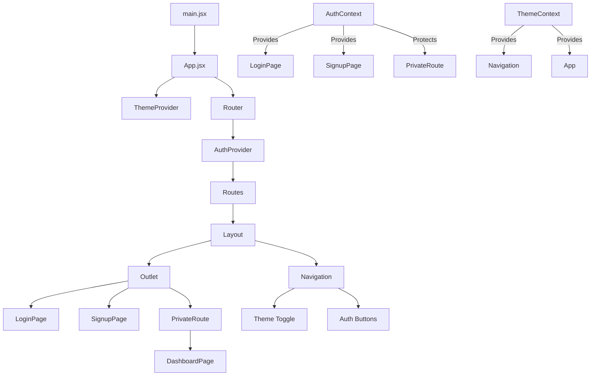
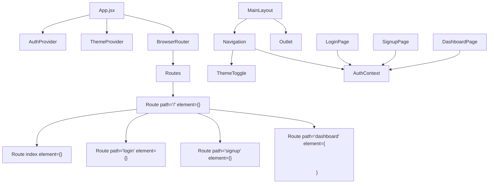

# Frontend Architecture Documentation

## Component Flow Diagram

## Component Descriptions

### 1. Core Components

#### `main.jsx`
- **Location**: `/src/main.jsx`
- **Purpose**: Application entry point
- **Key Features**:
  - Renders the root React component
  - Wraps the app in StrictMode
  - Mounts to the DOM element with id 'root'

#### `App.jsx`
- **Location**: `/src/App.jsx`
- **Purpose**: Root component that sets up the application
- **Key Features**:
  - Configures routing with React Router
  - Wraps the app in ThemeProvider and AuthProvider
  - Defines the main layout structure
  - Handles public and private routes

#### `Layout` (in App.jsx)
- **Purpose**: Main layout wrapper
- **Key Features**:
  - Contains the Navigation component
  - Renders child routes via Outlet
  - Includes a footer
  - Handles consistent page structure

### 2. Navigation Components

#### `Navigation.jsx`
- **Location**: `/src/components/Navigation.jsx`
- **Purpose**: Main navigation bar
- **Key Features**:
  - Responsive design
  - Theme toggle functionality
  - Authentication-aware UI
  - Conditional rendering based on auth state
  - Branding and navigation links

#### `ThemeToggle` (in Navigation)
- **Purpose**: Toggle between light/dark themes
- **Key Features**:
  - Visual theme indicator
  - Persistent theme preference
  - Accessible controls

### 3. Authentication Components

#### `AuthContext.jsx`
- **Location**: `/src/contexts/AuthContext.jsx`
- **Purpose**: Manages authentication state
- **Key Features**:
  - Firebase authentication integration
  - User state management
  - Login/logout functionality
  - Protected route handling

#### `PrivateRoute.jsx`
- **Location**: `/src/components/PrivateRoute.jsx`
- **Purpose**: Protects routes requiring authentication
- **Key Features**:
  - Redirects unauthenticated users to login
  - Preserves intended destination
  - Integrates with AuthContext

### 4. Page Components

#### `LoginPage.jsx`
- **Location**: `/src/pages/LoginPage.jsx`
- **Purpose**: User authentication
- **Key Features**:
  - Email/password login form
  - Form validation
  - Error handling
  - Google Sign-In integration
  - Remember me functionality

#### `SignupPage.jsx`
- **Location**: `/src/pages/SignupPage.jsx`
- **Purpose**: New user registration
- **Key Features**:
  - Registration form
  - Password confirmation
  - Form validation
  - Error handling
  - Link to login page

#### `DashboardPage.jsx`
- **Location**: `/src/pages/DashboardPage.jsx`
- **Purpose**: Main application dashboard
- **Key Features**:
  - Protected route
  - Placeholder for user content
  - Future file management interface

## Data Flow

1. **Authentication Flow**:
   - User enters credentials in LoginPage/SignupPage
   - AuthContext handles Firebase authentication
   - On success, user is redirected to dashboard
   - Navigation updates to show authenticated state

2. **Theme Flow**:
   - ThemeToggle component triggers theme changes
   - ThemeContext updates the theme state
   - All subscribed components re-render with new theme

3. **Routing Flow**:
   - Unauthenticated users are redirected to login
   - Authenticated users can access protected routes
   - Navigation updates based on current route

## Best Practices

1. **Component Structure**:
   - Small, focused components
   - Clear separation of concerns
   - Reusable UI elements

2. **State Management**:
   - Context API for global state
   - Local state for component-specific data
   - Minimal prop drilling

3. **Styling**:
   - Bootstrap for responsive design
   - CSS variables for theming
   - Consistent spacing and typography

4. **Performance**:
   - Lazy loading for routes
   - Memoization where appropriate
   - Efficient re-renders

## Future Improvements

1. **Features to Add**:
   - File upload/download functionality
   - User profile management
   - Password reset flow
   - Email verification

2. **Code Quality**:
   - Unit and integration tests
   - Error boundaries
   - Loading states
   - Enhanced form validation

3. **Performance**:
   - Code splitting
   - Image optimization
   - Bundle size analysis

## Component Overview

### Core Components

1. **App.jsx**
   - **Location**: `/src/App.jsx`
   - **Purpose**: The root component that sets up routing and global providers.
   - **Key Features**:
     - Configures React Router
     - Wraps the app with AuthProvider and ThemeProvider
     - Defines public and private routes

2. **MainLayout.jsx**
   - **Location**: `/src/components/MainLayout.jsx`
   - **Purpose**: Main layout wrapper that includes Navigation and renders child routes.
   - **Key Features**:
     - Consistent layout structure
     - Includes Navigation component
     - Uses React Router's Outlet for child routes

3. **Navigation.jsx**
   - **Location**: `/src/components/Navigation.jsx`
   - **Purpose**: Main navigation bar for the application.
   - **Key Features**:
     - Responsive design
     - Theme toggle
     - Authentication-aware UI
     - Branding/logo

### Authentication Components

4. **AuthContext.jsx**
   - **Location**: `/src/contexts/AuthContext.jsx`
   - **Purpose**: Manages authentication state and methods.
   - **Key Features**:
     - Firebase integration
     - User state management
     - Login/logout functionality

5. **PrivateRoute.jsx**
   - **Location**: `/src/components/PrivateRoute.jsx`
   - **Purpose**: Protects routes requiring authentication.
   - **Key Features**:
     - Redirects unauthenticated users
     - Preserves intended destination

### Theme Components

6. **ThemeContext.jsx**
   - **Location**: `/src/contexts/ThemeContext.jsx`
   - **Purpose**: Manages theme state (light/dark mode).
   - **Key Features**:
     - Theme state management
     - Theme toggle functionality
     - Persistent theme preference

7. **ThemeToggle.jsx**
   - **Location**: `/src/components/ThemeToggle.jsx`
   - **Purpose**: Toggles between light and dark themes.
   - **Key Features**:
     - Visual theme indicator
     - Toggle switch with icons

### Page Components

8. **LoginPage.jsx**
   - **Location**: `/src/pages/LoginPage.jsx`
   - **Purpose**: Handles user authentication.
   - **Key Features**:
     - Login form
     - Error handling
     - Google authentication

9. **SignupPage.jsx**
   - **Location**: `/src/pages/SignupPage.jsx`
   - **Purpose**: Handles new user registration.
   - **Key Features**:
     - Registration form
     - Form validation
     - Error handling

10. **DashboardPage.jsx**
    - **Location**: `/src/pages/DashboardPage.jsx`
    - **Purpose**: Main dashboard for authenticated users.
    - **Key Features**:
      - Displays user content
      - Placeholder for file management
      - Protected route

## Component Hierarchy

## Data Flow

1. **Authentication Flow**:
   - User enters credentials in LoginPage/SignupPage
   - AuthContext handles Firebase authentication
   - On success, user is redirected to dashboard
   - Navigation updates to show authenticated state

2. **Theme Flow**:
   - ThemeToggle component triggers theme changes
   - ThemeContext updates the theme state
   - All subscribed components re-render with new theme

3. **Routing Flow**:
   - Unauthenticated users are redirected to login
   - Authenticated users can access protected routes
   - Navigation updates based on current route

## Best Practices

1. **Component Structure**:
   - Keep components small and focused
   - Use context for global state
   - Follow container/component pattern

2. **Styling**:
   - Use Bootstrap's utility classes
   - Maintain consistent spacing
   - Ensure accessibility

3. **State Management**:
   - Use context for global states
   - Keep local state in components when possible
   - Avoid prop drilling

## Future Improvements

1. Add loading states for better UX
2. Implement error boundaries
3. Add more comprehensive form validation
4. Enhance mobile responsiveness
5. Add unit tests for components